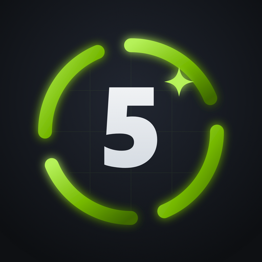

<h1 align="center">OptiDLSS5-UI</h1>

  
  

Downloads and bug reports for **OptiDLSS5-UI**, the Windows app that installs OptiScaler with DLSS 5 into your games.

## Download

Get **`OptiDLSS5-UI-Setup-*.exe`** from the [latest release](https://github.com/mrcgibb9876-hash/OptiDLSS5-UI-releases/releases/latest). The app updates itself after that. `OptiDLSS5-UI-Portable-*.exe` is the same app with nothing to install.

## Reporting a problem

Use **Send game failure** in the app, or [open an issue](https://github.com/mrcgibb9876-hash/OptiDLSS5-UI-releases/issues/new).

## Source

The app is closed source (all rights reserved). The engine it installs, OptiScaler_DLSSNR, is GPL-3.0 and the complete source for every engine release is published beside its build, as `OptiScaler_DLSSNR-<version>-source.zip`, at [mrcgibb9876-hash/OptiScaler_DLSSNR-releases](https://github.com/mrcgibb9876-hash/OptiScaler_DLSSNR-releases/releases).
